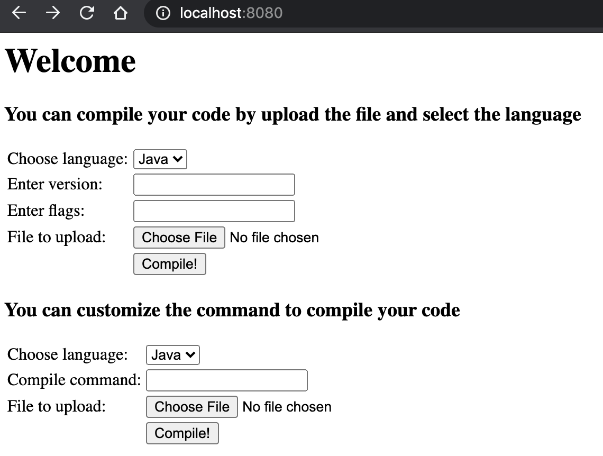

# Web Compiler

Web Compiler is a web service written in Java, which allows user to send and compile their code
on the server side.

## Feature
* Support Java(8-15) and Golang(1.08-1.13)
* Return .class for Java
* Return an executable for Go
* Provide ways to send flags and options to compier
* Allow users to customize their compile command

## How To Use

```bash
#build the project
./mvnw clean package

# Start the application
docker-compose up
```

After starting the application, visit [localhost:8080](localhost:8080)



After uploading the code and enter the proper values, the server will compile your code.

You can also refresh the page to see the files that are already stored on the server.

## Implementations
The command used to compile Java:

`javac --release version [options] [source_file] `

The command used to compile Go:

`go tool compile -lang=go[version] [options] [source_file] && go tool link -o binary_file 
object_file.o`

## APIs
There are two different REST APIs for the service:

```$xslt
curl --location --request POST 'http://localhost:8080/compiler?language=java&version=9' \
--form 'file=@/test_files/Sample.java' \
--form 'flags=-verbose'
```

```$xslt
curl --location --request POST 'http://localhost:8080/command?language=go' \
--form 'file=@/path/to/file' \
--form 'command=go tool compile -lang=go1.11 main.go && go tool link -o main main.o'
```

The second one allows user to customize the compile command based on their needs.

## FAQ
What are some limitations of the system?

   * Only support one source file to be compiled
    
   * Only support standard library for Java and Go

What is the framework used in the project?

    Spring Boot

What about the code you submit to the server?

    The code is stored in a temporary folder and will be removed once the server restarts.
    
Where is the log?
    
    `var/log/application.log`
